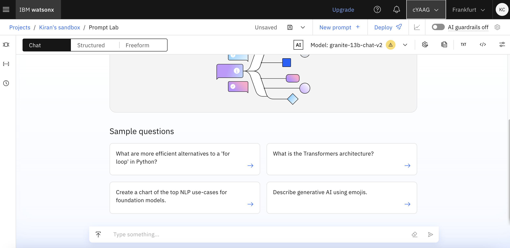
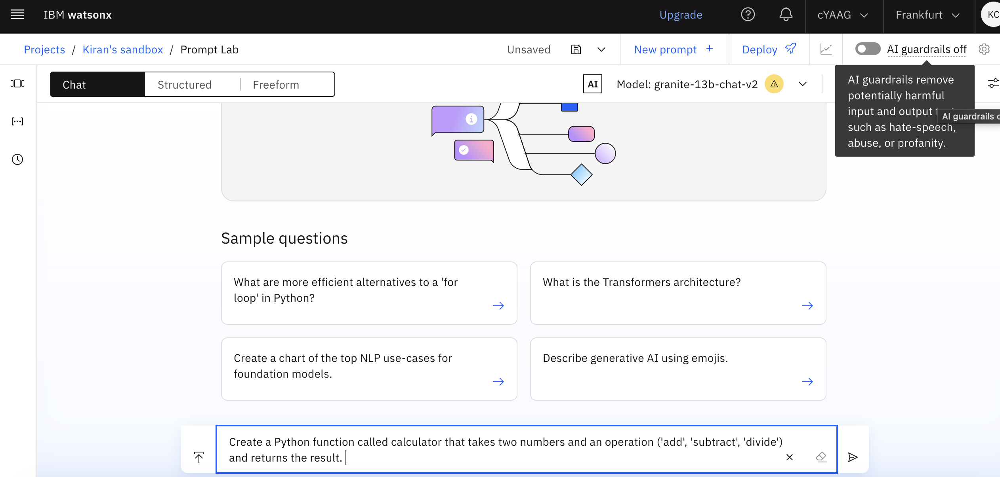
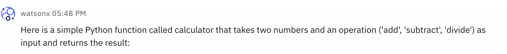
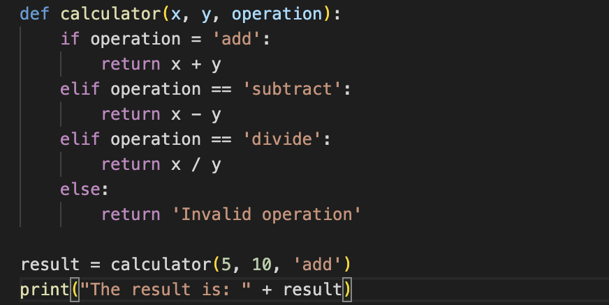

# **Code Troubleshooting Simulation Exercise using IBM Granite Model**

## Purpose
This simulation exercise is designed to guide participants in using the IBM Granite model to troubleshoot and refine AI-generated code through step-by-step interaction. The exercise includes identifying syntax and logical errors, functionality testing, output analysis, debugging, and static code analysis.

## Introduction
The IBM Granite model for code generation can help identify and correct errors in generated code. This exercise uses a problematic code snippet for a simple calculator application, guiding participants through a six-step troubleshooting sequence to practice and understand effective debugging techniques.

**Goal**: Troubleshoot and fix the issues in a basic calculator function code generated by the AI. The function aims to perform addition, subtraction, and division operations.

---

## Simulation Structure

### Step 1: Generate the Code in Watsonx Prompt Lab

**Instructions**: Begin by entering a prompt in the Watsonx Prompt Lab chat interface to generate code for a basic calculator that performs addition, subtraction, and division operations. 



Create a Python function called calculator that takes two numbers and an operation ('add', 'subtract', 'divide') and returns the result. 

**Generated Code**:

```python
def calculator(x, y, operation):
    if operation = 'add':
        return x + y
    elif operation == 'subtract':
        return x - y
    elif operation == 'divide':
        return x / y
    else:
        return 'Invalid operation'

result = calculator(5, 10, 'add')
print("The result is: " + result)
```
## Hands-On Troubleshooting Activity

### Step 1: Code Review
- **Instructions**: Review the AI-generated code snippet to identify potential issues.
- **Input Prompt in Watsonx Prompt Lab**: “What are the potential issues in this code?”
- **Expected Response**: IBM Granite should identify issues like the incorrect assignment operator `=` in the `if` statement and a potential `TypeError` in the `print` statement.

### Step 2: Syntax Checking
- **Instructions**: Focus on syntax errors within the code.
- **Input Prompt**: “Can you suggest corrections for any syntax errors in this code?”
- **Expected Response**: IBM Granite will suggest replacing `=` with `==` in `if operation = 'add':`.

### Step 3: Functionality Testing
- **Instructions**: Test the functionality of the code with given inputs.
- **Input Prompt**: “Run this code with input x=5 and y=10, operation='add'.”
- **Expected Response**: IBM Granite should identify a `TypeError` in the `print` statement, where concatenation of a string with an integer is causing an error.

### Step 4: Output Analysis
- **Instructions**: Analyze the output for logical errors.
- **Input Prompt**: “Does this output indicate any logical errors?”
- **Expected Response**: IBM Granite suggests modifying the `print` statement to include `str(result)` for correct data type handling.

### Step 5: Debugging
- **Instructions**: Use debugging tools to inspect variable values.
- **Input Prompt**: “What is the value of `operation` at this point in the code?”
- **Expected Response**: IBM Granite provides the value of the variable and any relevant insights into the logical flow.

### Step 6: Static Code Analysis
- **Instructions**: Perform a static analysis on the code snippet.
- **Input Prompt**: “Run a static analysis on this code and summarize the findings.”
- **Expected Response**: IBM Granite highlights areas for improvement, such as handling divide-by-zero errors and enforcing explicit data type conversions in the `print` function.
